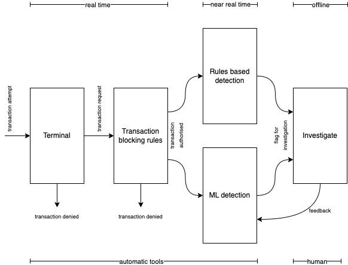

# Credit Card Fraud Detection (CCFD)

The following project was created to research the problem of credit card fraud.

Open source dataset: <https://www.kaggle.com/datasets/mlg-ulb/creditcardfraud>

Great resources:
- [Fraud Detection Handbook](https://fraud-detection-handbook.github.io/fraud-detection-handbook/)
- [Credit card fraud detection using machine
learning: A survey](https://arxiv.org/pdf/2010.06479.pdf)
---
## Background
According to the Common Library Research briefing released in 2022, criminals stole `£1.2b` from individuals in 2019 through banking and fraud scams, many of whom do not get their money back

Fraud and genuine spending patterns change over time, meaning ML models constantly need to be updated to flag fraudulent spending.

Transaction scenarios:
   - **CP - Card-present**
        -  e.g. ATM, POS
   - **CNP - Card-not-present**
        - e.g. internet, phone, mail

Currently, fraudsters are more likely to exploit the deficiency of CNP. This is because of the physicality needed with CP payments, as well as, well established fraud defense with CP. Chip in a card is one way the card companies defend against this. This is also known as chip-and-pin or **EMV** technology *(Europay Mastercard and Visa, i.e. chip-embedded cards)*.

CP fraud:
- Lost or stolen
    - usually characterised by spending a lot in a short period of time before the card is cancelled.
- Counterfeit card
    - usually produced by a skimming device, where a counterfeit card is produced. Can wait a long time before using this card since the owner is generally not aware.
- Card not received
    - card is intercepted in the mail, or fraudster has bank account login details and orders card to a different address. Owner is usually not aware this has happened so fraudsters may not spend rapidly at first.

CNP fraud:
- Fraudsters usually steal information then sell it on the dark web. Therefore those that steal the data and those that conduct the payment fraud are usually different groups
- Data breach
    - Company is hacked and leaks credit card and personal info
- Phishing
    - email or sms message tricks a user into providing personal or credit card information.
---
### Fraud detection systems

Generally consist of 5 layers of control:
 

 
1. Terminal
- Checks pin, sufficient balance, active account, etc.
- Executed very quickly (milliseconds).
2. Transaction blocking rules
- `if-else` statements that are very precise with their blocking.
- Usually blocked due to visiting a known fraudulent website or similar.
- Does not check the customers historical transactions to make a decision.
3. Rules based detection
- Rules based scoring built by experts. Score is usually a percentage, if past a threshold then send to investigator.
- E.g. "if previous transaction was in different continent 1hr ago then flag".
- Only flags known patterns and takes a lot of effort to maintain.
4. Machine Learning based detection
- An ML model that gives a percentage score of likelihood that transaction is fraudulent.
- Simplest model is a logistic regression.
- Will be regularly retrained to avoid model staleness.
5. Investigation (by human)
- A human investigator will deep dive into the customers behaviour and potentially speak to a customer to determine if the transaction(s) were fraudulent
- Can also send a message to a customer to check, but this can erode a customers trust if it occurs too often.
---
### Machine learning in CCFD

Common data used in CCFD problems
- Account: account ID, card limit, card expiry, date account was opened, etc.
- Transactions: transaction time, amount, terminal, country, etc.
- Customer: customer type (from segmentation model), etc.

Outputs of an CCFD model can be:
- Binary label of fraud or not.
- Probability of fraud or not.
- A risk real numbered risk score.

Common ML methods for CCFD are: Random forests, LSTM DL, SVMs, Logistic regression, boosted decision forest.

Challenges with CCFD problems
- Class imbalance
    - usually require techniques to handle this such as downsampling and loss weighting.
- Concept drift
    - genuine spending patterns and fraudulent patterns change over time, so models need to be robust to this change.
- Near real time requirements
    - ML CCFD problems have a huge volume of data to process, so they need to scale very well and be available in close to real time. Dealys in identifying fraud can cost huge amounts of money.
- Lack of public datasets
    - Due to the confidential nature of fraud detection, there are very few public datasets made available that researchers can use.
    - There is a famous credit fraud dataset made available on Kaggle, but this has undergone PCA dimensionality reduction on all the features which effectively takes away the ability for a human to analyse the data given all the features are obfuscated.
    - Simulators can be used instead to create synthetic data.
---
